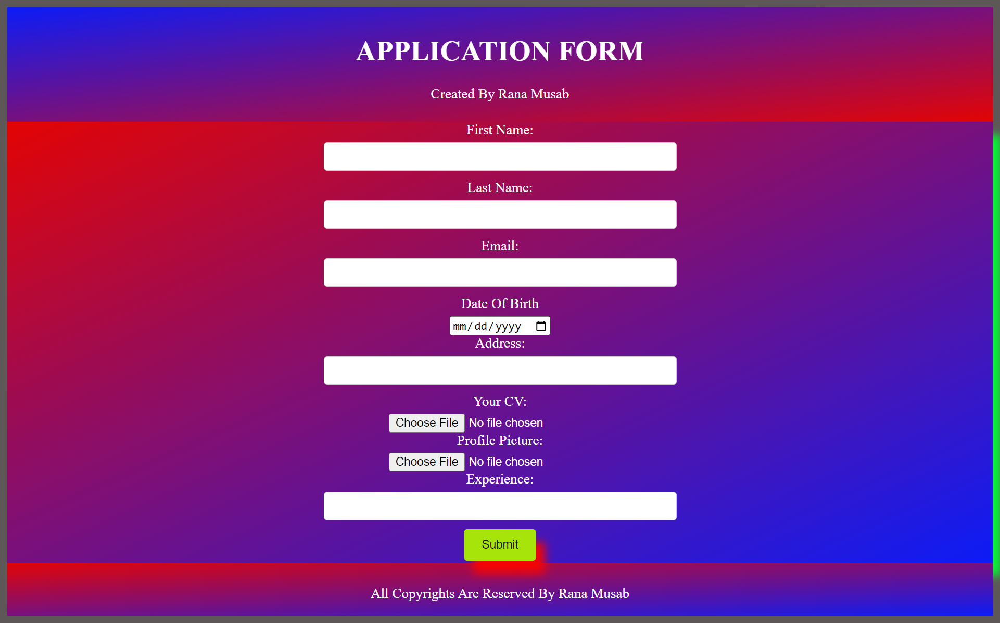

# Application Form

This is a simple application form created using HTML and CSS. It provides a user-friendly interface for collecting information from applicants.

## Features

- **Input Fields**: Various input fields such as text, email, and textarea for collecting applicant details.
- **Submit Button**: Allows applicants to submit their information.
- **Responsive Design**: The form is designed to be responsive and works well on different screen sizes.

## Usage

To use the application form, simply open the `index.html` file in a web browser. Fill out the required information in the form fields and click the submit button to submit the application.

## Preview

## Contributing

Contributions are welcome! If you'd like to contribute to the development of this application form, feel free to fork the repository and submit a pull request.

## License

This project is licensed under the Rana Musab.
